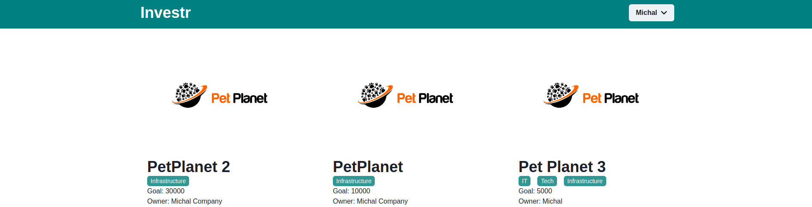

# Investr

### Instalacja - backend
<ul>
  <li><code>cd backend</code></li>
  <li><code>npm i</code></li>
  <li><code>cp .env.example .env</code></li>
  <li><code>sudo docker-compose build</code></li>
  <li><code>sudo docker-compose up</code></li>
</ul>
W drugim terminalu:
<ul>
  <li><code>cd backend</code></li>
  <li><code>npm run start:dev</code></li>
</ul>

### Instalacja frontend
<ul>
  <li><code>cd frontend</code></li>
  <li><code>npm i</code></li>
  <li><code>cp .env.example .env</code></li>
  <li><code>npm start</code></li>
</ul>

## Stack technologiczny
<ol>
  <li>backend
    <ul>
      <li>Nest.js</li>
      <li>Typeorm</li>
      <li>PostgreSQL</li>
    </ul>
  </li>
  <li>frontend
    <ul>
      <li>React</li>
      <li>chakra-ui</li>
      <li>axios</li>
    </ul>
  </li>
</ol>

## Uzasadnienie wyboru architektury
<blockquote>
  1. Modularność: Nest.js zachęca do używania modularnego podejścia do architektury, dzięki czemu łatwo jest izolować i kontrolować poszczególne elementy aplikacji. 
  2. Wykorzystuje TypeScript, który jest silnie typizowany, co zwiększa bezpieczeństwo i niezawodność kodu.
  3. Jest to kompleksowe i dojrzałe środowisko programistyczne. Zawiera wiele narzędzi i bibliotek, które mogą pomóc w tworzeniu skomplikowanych aplikacji z mniejszą ilością wysiłku.
</blockquote>

## Funkcjonalności
<ul>
  <li>Resestracja</li>
  <li>Logowanie</li>
  <li>Dodawanie produktów</li>
  <li>Listowanie produktów</li>
  <li>Usuwanie produktów</li>
</ul>

## Zdjęcie poglądowe
